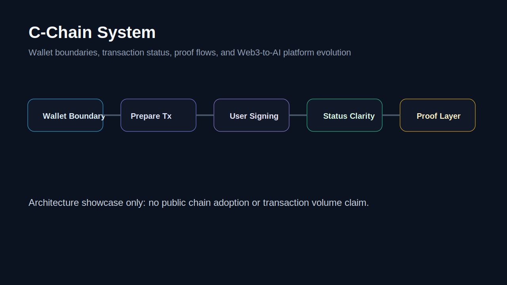

# C-Chain System Showcase

C-Chain System is a public-safe architecture showcase for wallet boundaries, transaction preparation, signing boundaries, finality/status clarity, proof flows, and Web3-to-AI platform evolution.

This repository is not a source-code mirror. It explains system design and product evolution.

## Problem

Web3 products need clear transaction preparation, signing boundaries, status, finality, and verification. Without those boundaries, AI or product interfaces can mislead users.

## What I Designed

- Wallet boundary model.
- Transaction preparation flow.
- Explicit signing boundary.
- Finality and status clarity.
- Proof and verification layer.
- Evolution path from WorldPeace DAO and C-Wallet toward TRACE ProofFeed.

## Architecture

See [docs/ARCHITECTURE.md](docs/ARCHITECTURE.md).

## Public Status

C-Chain is presented as architecture, design, and product evolution. It does not claim public chain adoption, transaction volume, users, or production deployment.
