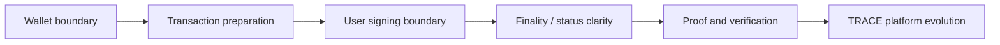

# Architecture

## Design Focus

- Keep AI suggestion separate from user signing.
- Make transaction status explicit.
- Treat verification as a product experience, not only a backend detail.
- Use this as a bridge between Web3 product design and AI verification systems.
